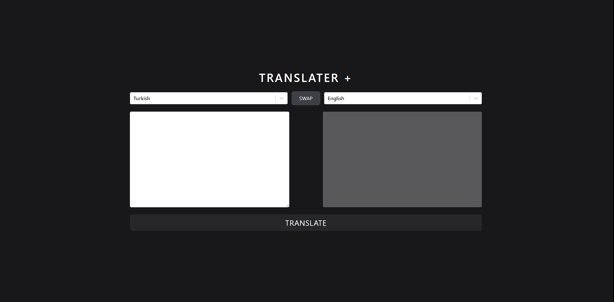

# Redux Toolkit Translater Project

## Description

The Redux Toolkit Translator Project is a web application that allows users to translate text between different languages. It leverages modern web technologies and efficient state management practices to provide a seamless user experience. This project is an excellent example of how to integrate Redux Toolkit with React and other popular libraries.

## Features

- Text Translation: Translate text between multiple languages using the Translater API.
- Language Selection: Choose source and target languages for translation.
- History Tracking: Keep track of previously translated texts.
- Responsive Design: Ensure a seamless experience across different devices.
- State Management: Efficient state management using Redux Toolkit.
- Custom Styling: Styled with Tailwind CSS for a modern look and feel.

## Libraries

- **Axios**: For making HTTP requests.
- **React-redux**: For managing the application's state.
- **@reduxjs/toolkit**: For efficient Redux development.
- **React-select**:For enhanced select box functionality.
- **Tailwind**:For utility-first CSS styling.

## API

The application uses the [Translater API](https://rapidapi.com/dickyagustin/api/text-translator2)

## Preview



## Deployment

The project is deployed and can be accessed [here](https://translator-git-main-quadriceps-projects.vercel.app/). For the project to run smoothly, please follow the installation steps below to set it up locally.

## Installation

To run the project locally, follow these steps:

1. Clone the repository:

```bash
git clone https://github.com/KamilErdogmus/Translator.git
```

2. Navigate to the project directory:

```bash
cd your-repository
```

3. Install dependencies:

```bash
npm install
```

4. Start the development server:

```bash
npm start / npm run dev
```

5. Open your web browser and visit http://localhost:3000 to view the application.

## Usage

- Translate Text: Enter text in the source language text box, select the source and target languages, and click the translate button to see the translated text.
- Language Selection: Use the dropdown menus to select the source and target languages.
- Translation History: View previously translated texts in the history section.
- Responsive Design: The application is responsive and can be used on various devices.
